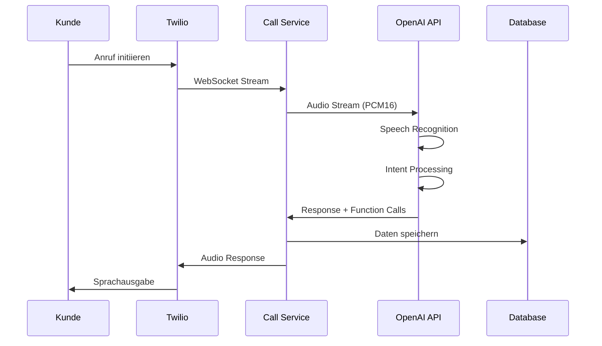

# 🔧 Technische Detailplanung - AI Call Agent

## 1. System-Architektur im Detail

### 1.1 Microservices Architektur

```
┌─────────────────────────────────────────────────────────────┐
│                      Load Balancer (nginx)                   │
└──────────────────────┬────────────────┬─────────────────────┘
                       │                │
              ┌────────▼────────┐ ┌─────▼──────┐
              │   API Gateway   │ │  WebSocket │
              │   (Express)     │ │   Server   │
              └────────┬────────┘ └─────┬──────┘
                       │                │
    ┌──────────────────┼────────────────┼──────────────────┐
    │                  │                │                  │
┌───▼────┐    ┌───────▼────────┐ ┌────▼─────┐    ┌──────▼──────┐
│ Auth   │    │ Call Manager   │ │ Audio    │    │ Analytics   │
│Service │    │   Service      │ │Processor │    │  Service    │
└────────┘    └───────┬────────┘ └──────────┘    └─────────────┘
                      │
         ┌────────────┼────────────┐
         │            │            │
    ┌────▼────┐ ┌────▼────┐ ┌────▼────┐
    │ OpenAI  │ │ Twilio  │ │Database │
    │Realtime │ │  API    │ │  Pool   │
    └─────────┘ └─────────┘ └─────────┘
```

### 1.2 Komponenten-Beschreibung

#### API Gateway
- **Technologie**: Express.js mit Rate Limiting
- **Funktionen**:
  - Request Routing
  - Authentication
  - Rate Limiting
  - API Versioning
  - Request/Response Logging

#### Call Manager Service
- **Kernfunktionalität**: Orchestrierung aller Anrufe
- **Features**:
  - Call State Management
  - Queue Management
  - Failover Handling
  - Call Recording
  - Metrics Collection

#### Audio Processor
- **Aufgaben**:
  - Audio Format Conversion (mulaw ↔ PCM16)
  - Noise Reduction
  - Volume Normalization
  - Echo Cancellation

#### Analytics Service
- **Metriken**:
  - Call Duration
  - Sentiment Analysis
  - Intent Recognition Rate
  - Customer Satisfaction Score
  - Cost per Call

---

## 2. OpenAI Realtime API Integration

### 2.1 Connection Management

```javascript
class RealtimeConnectionManager {
  constructor() {
    this.connections = new Map();
    this.reconnectAttempts = 3;
    this.reconnectDelay = 1000;
  }

  async createConnection(sessionId) {
    const connection = new RealtimeConnection({
      sessionId,
      config: {
        model: 'gpt-4o-realtime-preview',
        voice: 'alloy',
        instructions: this.getSystemPrompt(),
        temperature: 0.7,
        turn_detection: {
          type: 'server_vad',
          threshold: 0.5,
          prefix_padding_ms: 300,
          silence_duration_ms: 500
        }
      }
    });

    // Automatic reconnection logic
    connection.on('disconnect', () => {
      this.handleReconnect(sessionId);
    });

    this.connections.set(sessionId, connection);
    return connection;
  }

  async handleReconnect(sessionId) {
    // Exponential backoff reconnection
    let attempt = 0;
    while (attempt < this.reconnectAttempts) {
      try {
        await this.wait(this.reconnectDelay * Math.pow(2, attempt));
        await this.createConnection(sessionId);
        break;
      } catch (error) {
        attempt++;
      }
    }
  }
}
```

### 2.2 Konversations-Flow



---

## 3. Datenmodell

### 3.1 PostgreSQL Schema

```sql
-- Calls Table
CREATE TABLE calls (
    id UUID PRIMARY KEY DEFAULT gen_random_uuid(),
    call_sid VARCHAR(255) UNIQUE NOT NULL,
    phone_number VARCHAR(50) NOT NULL,
    status VARCHAR(50) NOT NULL,
    start_time TIMESTAMP NOT NULL,
    end_time TIMESTAMP,
    duration_seconds INTEGER,
    cost_cents INTEGER,
    sentiment_score DECIMAL(3,2),
    created_at TIMESTAMP DEFAULT CURRENT_TIMESTAMP,
    updated_at TIMESTAMP DEFAULT CURRENT_TIMESTAMP
);

-- Conversations Table
CREATE TABLE conversations (
    id UUID PRIMARY KEY DEFAULT gen_random_uuid(),
    call_id UUID REFERENCES calls(id),
    role VARCHAR(50) NOT NULL, -- 'assistant' or 'user'
    content TEXT NOT NULL,
    timestamp TIMESTAMP NOT NULL,
    intent VARCHAR(100),
    confidence_score DECIMAL(3,2)
);

-- Function Calls Table
CREATE TABLE function_calls (
    id UUID PRIMARY KEY DEFAULT gen_random_uuid(),
    call_id UUID REFERENCES calls(id),
    function_name VARCHAR(100) NOT NULL,
    arguments JSONB NOT NULL,
    result JSONB,
    executed_at TIMESTAMP DEFAULT CURRENT_TIMESTAMP,
    success BOOLEAN DEFAULT true
);

-- Analytics Table
CREATE TABLE call_analytics (
    id UUID PRIMARY KEY DEFAULT gen_random_uuid(),
    call_id UUID REFERENCES calls(id),
    metric_name VARCHAR(100) NOT NULL,
    metric_value DECIMAL(10,2) NOT NULL,
    recorded_at TIMESTAMP DEFAULT CURRENT_TIMESTAMP
);

-- Indexes
CREATE INDEX idx_calls_phone_number ON calls(phone_number);
CREATE INDEX idx_calls_start_time ON calls(start_time);
CREATE INDEX idx_conversations_call_id ON conversations(call_id);
CREATE INDEX idx_function_calls_call_id ON function_calls(call_id);
```

### 3.2 Redis Cache Structure

```javascript
// Session Storage
const sessionKey = `session:${sessionId}`;
const sessionData = {
  callSid: 'CA123...',
  phoneNumber: '+49123456789',
  startTime: Date.now(),
  context: {
    customerName: 'Max Mustermann',
    accountId: '12345',
    lastIntent: 'appointment_booking'
  },
  audioBuffer: [], // Temporary audio buffer
  transcription: [] // Real-time transcription
};

// Rate Limiting
const rateLimitKey = `ratelimit:${phoneNumber}`;
const rateLimitData = {
  count: 5,
  resetAt: Date.now() + 3600000 // 1 hour
};

// Analytics Cache
const analyticsKey = `analytics:${date}`;
const analyticsData = {
  totalCalls: 156,
  avgDuration: 245, // seconds
  successRate: 0.89,
  intents: {
    appointment: 45,
    support: 67,
    info: 44
  }
};
```

---

## 4. Sicherheitskonzept

### 4.1 Verschlüsselung

```javascript
// End-to-End Encryption für sensible Daten
import crypto from 'crypto';

class EncryptionService {
  constructor() {
    this.algorithm = 'aes-256-gcm';
    this.key = Buffer.from(process.env.ENCRYPTION_KEY, 'hex');
  }

  encrypt(text) {
    const iv = crypto.randomBytes(16);
    const cipher = crypto.createCipheriv(this.algorithm, this.key, iv);
    
    let encrypted = cipher.update(text, 'utf8', 'hex');
    encrypted += cipher.final('hex');
    
    const authTag = cipher.getAuthTag();
    
    return {
      encrypted,
      iv: iv.toString('hex'),
      authTag: authTag.toString('hex')
    };
  }

  decrypt(encryptedData) {
    const decipher = crypto.createDecipheriv(
      this.algorithm,
      this.key,
      Buffer.from(encryptedData.iv, 'hex')
    );
    
    decipher.setAuthTag(Buffer.from(encryptedData.authTag, 'hex'));
    
    let decrypted = decipher.update(encryptedData.encrypted, 'hex', 'utf8');
    decrypted += decipher.final('utf8');
    
    return decrypted;
  }
}
```

### 4.2 Authentication & Authorization

```javascript
// JWT-based Authentication
class AuthService {
  generateToken(payload) {
    return jwt.sign(payload, process.env.JWT_SECRET, {
      expiresIn: '24h',
      issuer: 'marcus-call-agent'
    });
  }

  verifyToken(token) {
    try {
      return jwt.verify(token, process.env.JWT_SECRET);
    } catch (error) {
      throw new UnauthorizedError('Invalid token');
    }
  }

  // Role-based Access Control
  checkPermission(user, resource, action) {
    const permissions = {
      admin: ['*'],
      operator: ['calls:read', 'calls:create', 'analytics:read'],
      viewer: ['calls:read', 'analytics:read']
    };

    const userPermissions = permissions[user.role] || [];
    const requiredPermission = `${resource}:${action}`;

    return userPermissions.includes('*') || 
           userPermissions.includes(requiredPermission);
  }
}
```

---

## 5. Performance Optimierung

### 5.1 Audio Streaming Pipeline

```javascript
// Optimized Audio Processing Pipeline
class AudioPipeline {
  constructor() {
    this.bufferSize = 8192; // Optimal für niedrige Latenz
    this.sampleRate = 16000; // 16kHz für Sprache
    this.channels = 1; // Mono
  }

  createProcessingStream() {
    return new Transform({
      transform(chunk, encoding, callback) {
        // Convert μ-law to PCM16
        const pcmData = this.mulawToPCM16(chunk);
        
        // Apply noise reduction
        const cleanData = this.reduceNoise(pcmData);
        
        // Normalize volume
        const normalizedData = this.normalizeVolume(cleanData);
        
        callback(null, normalizedData);
      }
    });
  }

  mulawToPCM16(mulawData) {
    // Optimierte μ-law zu PCM16 Konvertierung
    const pcmData = Buffer.alloc(mulawData.length * 2);
    for (let i = 0; i < mulawData.length; i++) {
      const pcmValue = this.mulawTable[mulawData[i]];
      pcmData.writeInt16LE(pcmValue, i * 2);
    }
    return pcmData;
  }
}
```

### 5.2 Caching Strategy

```javascript
// Multi-Level Caching
class CacheManager {
  constructor() {
    this.l1Cache = new Map(); // In-Memory Cache
    this.l2Cache = redis.createClient(); // Redis Cache
    this.ttl = {
      hot: 300,    // 5 minutes
      warm: 3600,  // 1 hour
      cold: 86400  // 24 hours
    };
  }

  async get(key, options = {}) {
    // Check L1 Cache first
    if (this.l1Cache.has(key)) {
      return this.l1Cache.get(key);
    }

    // Check L2 Cache
    const l2Value = await this.l2Cache.get(key);
    if (l2Value) {
      // Promote to L1
      this.l1Cache.set(key, l2Value);
      return l2Value;
    }

    // Fetch from source if provided
    if (options.fetchFn) {
      const value = await options.fetchFn();
      await this.set(key, value, options.ttl || 'warm');
      return value;
    }

    return null;
  }

  async set(key, value, ttlType = 'warm') {
    // Set in both caches
    this.l1Cache.set(key, value);
    await this.l2Cache.setex(key, this.ttl[ttlType], JSON.stringify(value));
  }
}
```

---

## 6. Monitoring & Observability

### 6.1 Metrics Collection

```javascript
// Prometheus Metrics
import { register, Counter, Histogram, Gauge } from 'prom-client';

class MetricsCollector {
  constructor() {
    // Call Metrics
    this.callsTotal = new Counter({
      name: 'calls_total',
      help: 'Total number of calls',
      labelNames: ['status', 'intent']
    });

    this.callDuration = new Histogram({
      name: 'call_duration_seconds',
      help: 'Call duration in seconds',
      buckets: [30, 60, 120, 300, 600]
    });

    this.activeCalls = new Gauge({
      name: 'active_calls',
      help: 'Number of active calls'
    });

    // Performance Metrics
    this.responseTime = new Histogram({
      name: 'ai_response_time_ms',
      help: 'AI response time in milliseconds',
      buckets: [100, 200, 300, 500, 1000]
    });

    // Cost Metrics
    this.apiCosts = new Counter({
      name: 'api_costs_cents',
      help: 'API costs in cents',
      labelNames: ['service']
    });
  }

  recordCall(status, intent, duration) {
    this.callsTotal.labels(status, intent).inc();
    this.callDuration.observe(duration);
  }

  recordResponseTime(service, timeMs) {
    this.responseTime.observe(timeMs);
  }
}
```

### 6.2 Logging Strategy

```javascript
// Structured Logging with Context
class CallLogger {
  constructor(logger) {
    this.logger = logger;
  }

  logCallEvent(event, context) {
    const logEntry = {
      timestamp: new Date().toISOString(),
      event,
      callId: context.callId,
      sessionId: context.sessionId,
      phoneNumber: this.maskPhoneNumber(context.phoneNumber),
      ...context.metadata
    };

    switch (event) {
      case 'call.started':
        this.logger.info('Call started', logEntry);
        break;
      case 'call.ended':
        this.logger.info('Call ended', {
          ...logEntry,
          duration: context.duration,
          cost: context.cost
        });
        break;
      case 'error':
        this.logger.error('Call error', {
          ...logEntry,
          error: context.error,
          stack: context.stack
        });
        break;
    }
  }

  maskPhoneNumber(phoneNumber) {
    // DSGVO-konform: Maskiere Telefonnummer
    return phoneNumber.replace(/(\d{3})\d{4}(\d{4})/, '$1****$2');
  }
}
```

---

## 7. Deployment & DevOps

### 7.1 Docker Configuration

```dockerfile
# Dockerfile
FROM node:18-alpine AS builder

WORKDIR /app
COPY package*.json ./
RUN npm ci --only=production

FROM node:18-alpine

RUN apk add --no-cache ffmpeg # Für Audio-Processing

WORKDIR /app
COPY --from=builder /app/node_modules ./node_modules
COPY . .

# Security: Non-root user
RUN addgroup -g 1001 -S nodejs
RUN adduser -S nodejs -u 1001
USER nodejs

EXPOSE 3000 3001
CMD ["node", "src/index.js"]
```

### 7.2 Kubernetes Deployment

```yaml
# deployment.yaml
apiVersion: apps/v1
kind: Deployment
metadata:
  name: call-agent
spec:
  replicas: 3
  selector:
    matchLabels:
      app: call-agent
  template:
    metadata:
      labels:
        app: call-agent
    spec:
      containers:
      - name: call-agent
        image: marcus-call-agent:latest
        ports:
        - containerPort: 3000
        - containerPort: 3001
        env:
        - name: OPENAI_API_KEY
          valueFrom:
            secretKeyRef:
              name: api-secrets
              key: openai-key
        resources:
          requests:
            memory: "512Mi"
            cpu: "500m"
          limits:
            memory: "1Gi"
            cpu: "1000m"
        livenessProbe:
          httpGet:
            path: /health
            port: 3000
          initialDelaySeconds: 30
          periodSeconds: 10
        readinessProbe:
          httpGet:
            path: /ready
            port: 3000
          initialDelaySeconds: 5
          periodSeconds: 5
---
# service.yaml
apiVersion: v1
kind: Service
metadata:
  name: call-agent-service
spec:
  selector:
    app: call-agent
  ports:
  - name: http
    port: 80
    targetPort: 3000
  - name: websocket
    port: 3001
    targetPort: 3001
  type: LoadBalancer
```

---

## 8. Testing Strategy

### 8.1 Unit Tests

```javascript
// call-handler.test.js
describe('CallHandler', () => {
  let callHandler;
  let mockRealtimeClient;

  beforeEach(() => {
    mockRealtimeClient = {
      connect: jest.fn(),
      sendAudio: jest.fn(),
      disconnect: jest.fn()
    };
    callHandler = new CallHandler(mockRealtimeClient);
  });

  test('should initialize call successfully', async () => {
    mockRealtimeClient.connect.mockResolvedValue();
    
    await callHandler.startCall();
    
    expect(mockRealtimeClient.connect).toHaveBeenCalled();
    expect(callHandler.isActive).toBe(true);
  });

  test('should handle audio input correctly', () => {
    callHandler.isActive = true;
    const audioData = Buffer.from('test audio');
    
    callHandler.processAudioInput(audioData);
    
    expect(mockRealtimeClient.sendAudio).toHaveBeenCalledWith(audioData);
  });
});
```

### 8.2 Integration Tests

```javascript
// integration.test.js
describe('Call Flow Integration', () => {
  test('complete call flow', async () => {
    const response = await request(app)
      .post('/api/calls/outbound')
      .send({ phoneNumber: '+49123456789' });
    
    expect(response.status).toBe(200);
    expect(response.body).toHaveProperty('callSid');
    
    // Wait for call to establish
    await new Promise(resolve => setTimeout(resolve, 2000));
    
    // Check call status
    const status = await request(app)
      .get(`/api/calls/${response.body.callSid}`);
    
    expect(status.body.status).toBe('in-progress');
  });
});
```

---

## 9. Disaster Recovery

### 9.1 Backup Strategy

```bash
#!/bin/bash
# backup.sh

# Database Backup
pg_dump $DATABASE_URL | gzip > backup_$(date +%Y%m%d_%H%M%S).sql.gz

# Upload to S3
aws s3 cp backup_*.sql.gz s3://marcus-backups/database/

# Redis Backup
redis-cli --rdb /tmp/redis_backup.rdb
aws s3 cp /tmp/redis_backup.rdb s3://marcus-backups/redis/

# Cleanup old backups (keep 30 days)
find . -name "backup_*.sql.gz" -mtime +30 -delete
```

### 9.2 Failover Plan

```javascript
// Automatic Failover
class FailoverManager {
  constructor() {
    this.primaryRegion = 'eu-central-1';
    this.fallbackRegion = 'eu-west-1';
    this.healthCheckInterval = 30000; // 30 seconds
  }

  async monitorHealth() {
    setInterval(async () => {
      try {
        await this.checkPrimaryHealth();
      } catch (error) {
        logger.error('Primary region unhealthy', error);
        await this.switchToFallback();
      }
    }, this.healthCheckInterval);
  }

  async switchToFallback() {
    // Update DNS
    await this.updateRoute53(this.fallbackRegion);
    
    // Notify team
    await this.sendAlert('Failover initiated to ' + this.fallbackRegion);
    
    // Start recovery process
    this.initiateRecovery();
  }
}
```

---

Diese technische Dokumentation bietet einen tiefen Einblick in die Implementierungsdetails und Best Practices für den AI Call Agent.